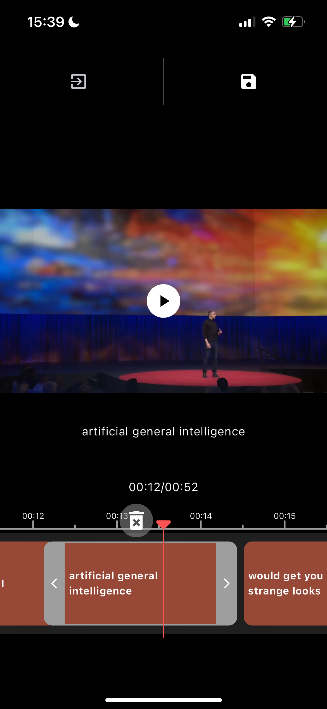

# Flutter subtitle editor


A video subtitle editing library that includes subtitle generation, subtitle editing,
subtitle export, and related UI components for Flutter.

|             | Android | iOS   |
|-------------|---------|-------|
| **Support** | SDK 16+ | 11.0+ |

## 📖 Installation

Following steps will help you add this library as a dependency in your flutter project.

- Run `flutter pub add video_editor`, or add video_editor to `pubspec.yaml` file manually.

```yaml
dependencies:
```

- Import the package in your code:

```dart
import 'package:video_subtitle_editor/video_subtitle_editor.dart';
```

## 📸 Screenshots

| subtitle slider                   | edit text                      |
|-----------------------------------|--------------------------------|
|  |  |

## 👀 Usage

```dart
 ### 1. Init subtitle controller
  late final VideoSubtitleController _controller = VideoSubtitleController.file(
  widget.videoFile,
  );

@override
void initState() {
  super.initState();
  @override
  void initState() {
super.initState();
var subtitlePath = "assets/test.srt";
var controller = SubtitleController(
provider: AssetSubtitle(subtitlePath),
);
_controller
    .initializeVideo()
    .then((_) =>
setState(() {}))
    .catchError((error) {});
_controller.initialSubtitles(controller);
_controller.addListener(
() {
setState(() {});
},
);
}
}

@override
void dispose() {
  _controller.dispose();
  super.dispose();
}

 2. add video viewer
 VideoViewer(
    controller: controller,
    child: SubtitleTextView(
    controller: controller,
    ),
  );

 3. add subtitle viewer
  SubtitleSlider(
    height: 100,
    controller: _controller,
  ),
 4. add subtitle export button
  ElevatedButton(
  onPressed: () async {
  await _controller.exportVideo();
  },
  child: Text('Export'),
  ),
```

For more details check out the [example](https://github.com/wxkly8888/video_subtitle_editor/tree/main/example).
