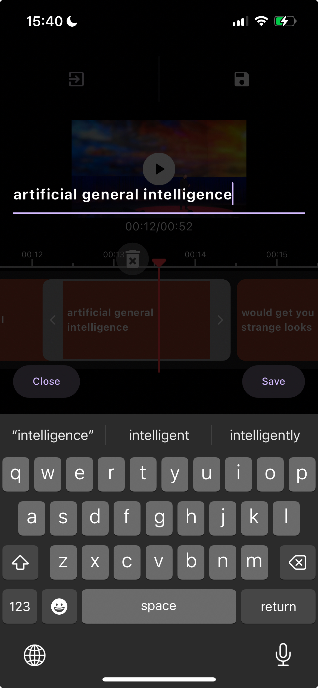

# Flutter subtitle editor


About
A comprehensive video subtitle editing library offering tools for subtitle editing,
export, and a suite of UI components.

|             | Android | iOS   |
|-------------|---------|-------|
| **Support** | SDK 16+ | 11.0+ |

## 📖 Installation

Following steps will help you add this library as a dependency in your flutter project.

- Run `flutter pub add video_subtitle_editor`, or add video_subtitle_editor to `pubspec.yaml` file manually.

```yaml
dependencies:
  video_subtitle_editor: ^1.0.0
```

- Import the package in your code:

```dart
import 'package:video_subtitle_editor/video_subtitle_editor.dart';
```

## 📸 Screenshots

| subtitle slider                   | edit text                      |
|-----------------------------------|--------------------------------|
|  |  |

## 👀 Usage
### 1. Init controller, you can init a [VideoSubtitleController] controller with a video file from local or from assets
```dart
  late final VideoSubtitleController _controller = VideoSubtitleController.file(
  widget.videoFile,
  );

@override
void initState() {
  super.initState();
  @override
  void initState() {
    super.initState();
    var subtitlePath = "assets/test.srt";
    var controller = SubtitleController(
      provider: AssetSubtitle(subtitlePath),
    );
    _controller
    .initializeVideo()
    .then((_) =>
      setState(() {}))
    .catchError((error) {});
    _controller.initialSubtitles(controller);
    _controller.addListener(
        () {
          setState(() {});
          },
      );
    }
    }

@override
void dispose() {
  _controller.dispose();
  super.dispose();
}
```

### 2. add video viewer [VideoViewer] into you widget tree, [SubtitleTextView] is the widget to show subtitle text
```dart
 VideoViewer(
    controller: controller,
    child: SubtitleTextView(
    controller: controller,
    ),
  );
```
### 3. add subtitle slider. this widget is used to slide the subtitle text to adjust the subtitle time
```dart
  SubtitleSlider(
    height: 100,
    controller: _controller,
  ),
```

For more details check out the [example](https://github.com/wxkly8888/video_subtitle_editor/tree/main/example).
